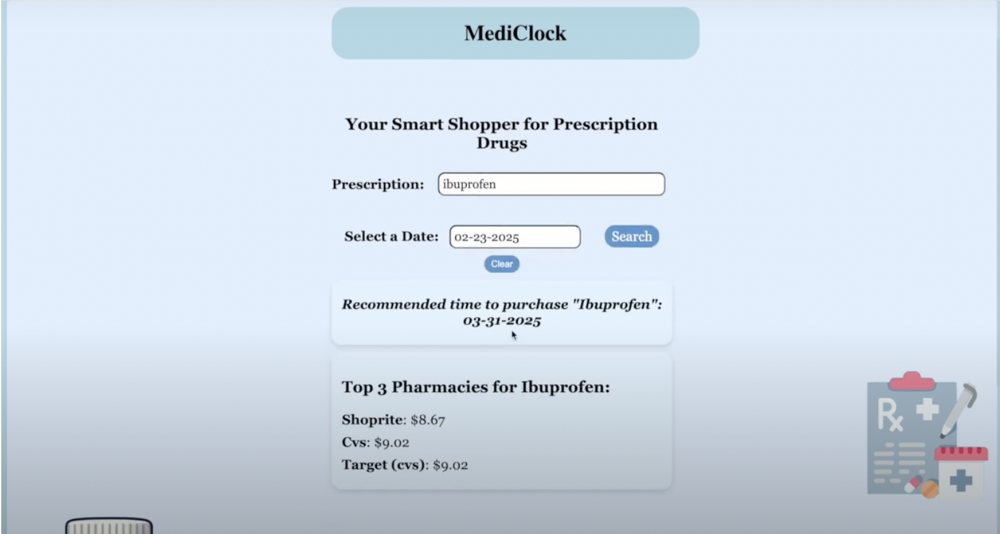

## 💡 Inspiration
Prescription medications are a necessity, but their prices should not feel like a gamble. Too often, people find themselves overpaying simply because they lack transparent pricing information. We wanted to put control back in the hands of the consumer, giving them the tools to make informed decisions about their healthcare costs. Our web app empowers individuals to plan ahead and take charge of their prescription purchases. Smart shopping isn’t just for groceries–it should apply to healthcare too.

## 🚀 What it does
By predicting the best times of the year to purchase specific medications, our service helps customers decide whether to buy now or wait for a better price. Plus, it finds the most cost-effective pharmacies in the local Atlanta area, ensuring customers don’t overspend when they don’t have to. The final decision is always in their hands–we just give them the insights to make smarter choices.

## 🛠 How we built it
We analyzed five years’ worth of pharmaceutical data (2014-2019) to detect trends in prescription drug sales. Using time-series forecasting (SARIMA model, ACF and PACF plots), we predicted future price fluctuations, pinpointing the most cost-effective times to buy. By combining this predictive power with real-time pharmacy pricing data, we created a tool that takes the guesswork out of purchasing essential medications. In addition to predicting prices, we web scrape current prescription drug prices on a daily schedule using AWS. Through the use of AWS EventBridge, Lambda, ECR, and S3, we scrape and store the current prices of medications to inform users where their prescription drugs are cheapest to buy right now.

## 😰 Challenges we ran into
Data science can be tricky, and we hit a few roadblocks along the way. Our initial time-series analysis struggled to generate reliable future trend visualizations, forcing us to rethink our approach. On the development side, scraping real-time pharmacy data proved challenging—many websites blocked our scrapers, preventing bots from accessing their data. We were trying to build our own scraper, which had to click on buttons and get data from the new pages generated from the button clicks. The data that it was getting, however, was data from the old page before the button clicks. This problem took up many hours of our time until eventually, it suddenly worked, getting the new data rather than the data from the original page. However, when we ran it again, the old problem persisted. Eventually, we decided to go a different route for web-scraping, using a premade API called Firecrawl that performs web-scraping. We also ran into challenges while using this, as we only got 500 credits per API key, meaning there was a limit to how much scraping we could do. Overcoming these hurdles tested our resilience, but ultimately, it made our platform stronger and more robust.

## ⭐️ Accomplishments that we're proud of
This project was full of firsts—our first time tackling time-series analysis, our first web scraper, and our first fully built React application. Although our attempt at writing our own web-scraper was unsuccessful in the end, we are proud to have learned a lot about web-scraping in the process. We are also proud that we were able to implement the Firecrawl web-scraper into our application. Learning to merge data science with web development was an exciting challenge, and seeing everything come together into a functional, real-world solution was incredibly rewarding.

## 🔮 What's next for MediClock
We envision MediClock as a Chrome extension that provides real-time notifications on the best times to buy prescriptions!
